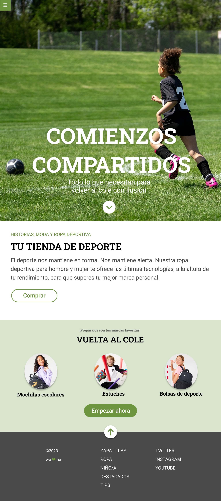

## Reto
Desarrollar una página web de acuerdo a un diseño proporcionado. 
- Usar Sass.
- Usar flexbox y CSS Grid.
- Usar media queries.
- Como extra: resolver algunas interacciones usando transiciones.

## Maquetación
En primer lugar se debe realizar la maquetación sobre un diseño dado:

<!--  -->

###

1. El botón de hamburguesa debe estar fijo.
2. **Hero**: Maquetado con flexbox.
3. **Tu tienda deporte**: Libre elección de maquetado.
4. **Vuelta al cole**: Maquetado con CSS Grid.
5. **Footer**: Maquetado con flexbox + enlaces a Adalab.

### Interacción:
1. El botón del hero enlaza a **Vuelta al cole**.
2. El botón del footer enlaza al **hero**.
3. Todos los enlaces de footer enlazan a https://adalab.es
4. **BONUS**: Investigar propiedades de *transform* y *transition* usando :hover.
5. **BONUS**: Investigar propiedad de *animation*

### Criterios.
- Usar una estructura adecuada de ficheros y carpetas, enlazando bien cada fichero.
- Control de versiones con ramas.
- Crear código **HTML**:
  - Bien estructurado.
  - Adecuado semánticamente.
  - Perfectamente **indentado**.
- Crear **CSS/Sass**:
  - Bien estructurado.
  - Adecuado semánticamente.
  - Perfectamente **indentado**.
  - Uso de **variables, anidaciones y parciales**.
  - Uso de **selectores de clase** y no de etiqueta o ID.
  - Selectores en **inglés**.
  - Uso correcto de **modelo de caja**: tamaños, rellenos, márgenes.
  - Uso estilos de texto y fondo.
  - Uso de **flexbox** de forma adecuada.
  - Uso de **media queries**.
  - Uso de posicionamiento para elementos **fijos** y **absolutos**.
  - Uso de CSS **grid**.
  - Uso de **transiciones** CSS.

## Comentarios

Con este reto asenté las bases y aprendí a usar mixins en HTML y SCSS.
>**EsterEgg**: encuentra la animación en el corazón.

## DIY
> **NOTA:** Necesitas tener instalado [Node JS](https://nodejs.org/)

1. Instalar los módulos: `npm i`
2. Iniciar proyecto: `npm run dev`

Para cualquier modificación en directo, editar los archivos en `src`. Para añadir imágenes: `public/images`.

> **CTRL+C** para finalizar el proyecto
3. Montar el despliegue: `npm run docs`

4. Montar y subir el despliegue: `npm run deploy`
